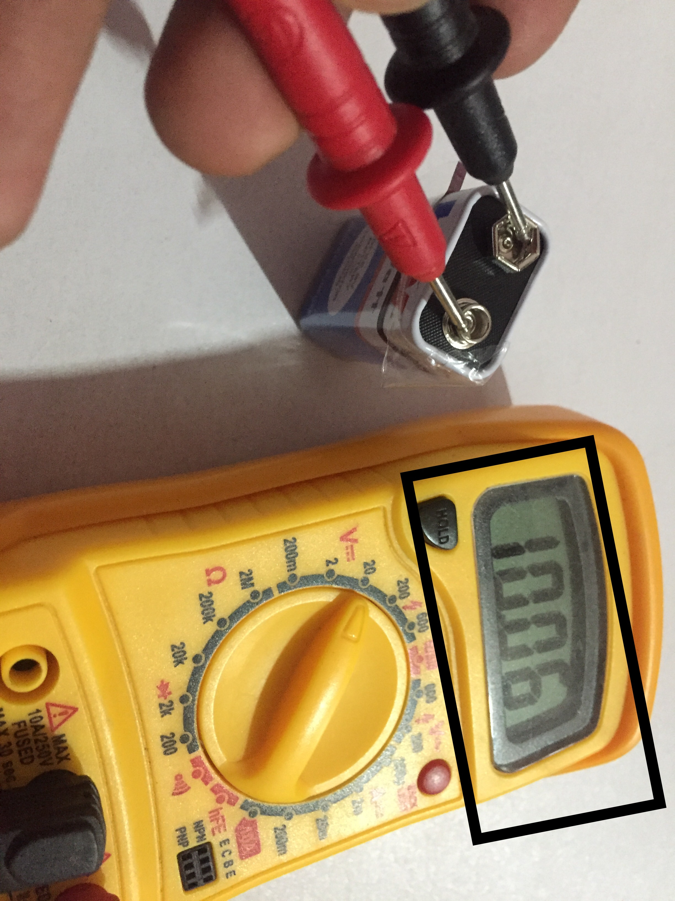

# Session - 2 Worked-out examples

## Basic Elements
• Battery voltage 
• Measuring Battery voltage
• Led circuit 

  
  

## Arduino

1. Blinking internal LED of an Arduino 

  
  

2. Start your first program Using LED

  

  

3. Auto on the street lights when its dark using LDR
  
  

  
4. Is there any obstacle? Using Ultrasonic sensor
  
  
  
  
  
