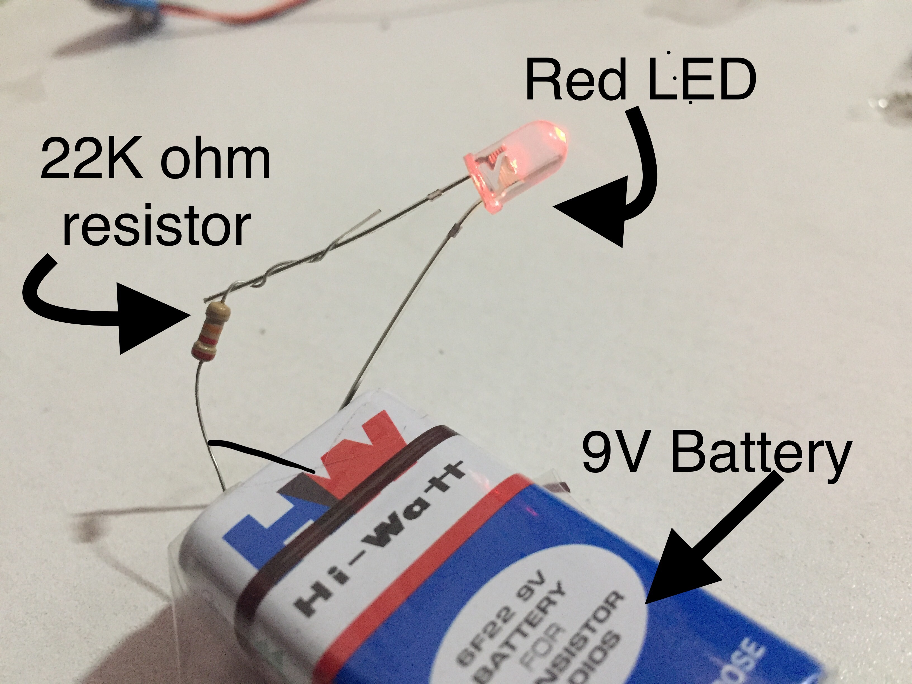

# ReadMe Session - 2 Nexiot001

## Basic Elements:
	•	Battery voltage 
	•	Measuring Battery voltage
	•	Led circuit 
 

## Arduino

1 Blinking internal LED of an Arduino 

 

2 Start your first program Using LED

3 Auto on the street lights when its dark using LDR

4 Is there any obstacle? Using Ultrasonic sensor

