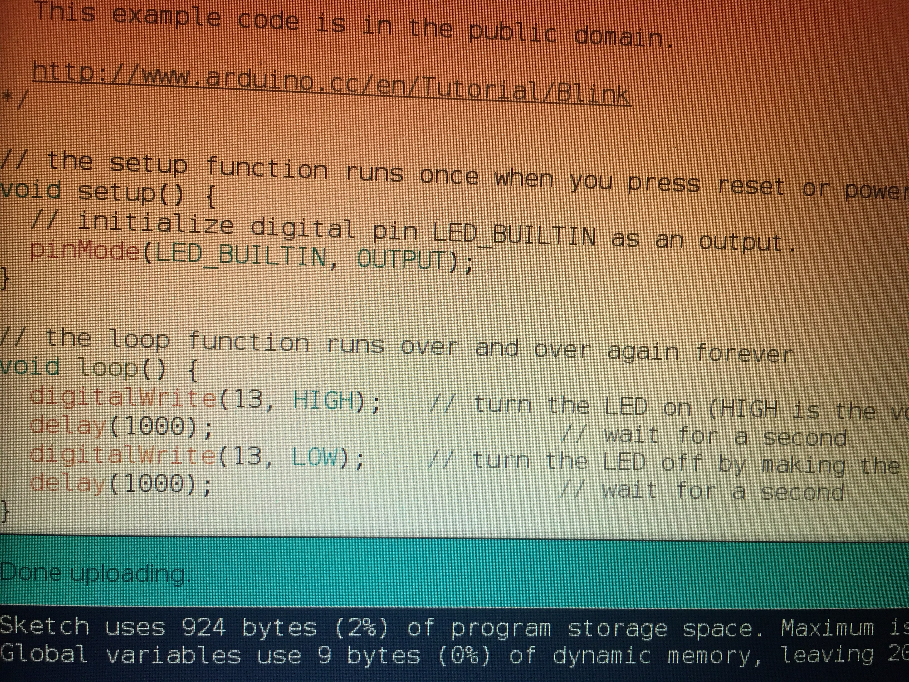
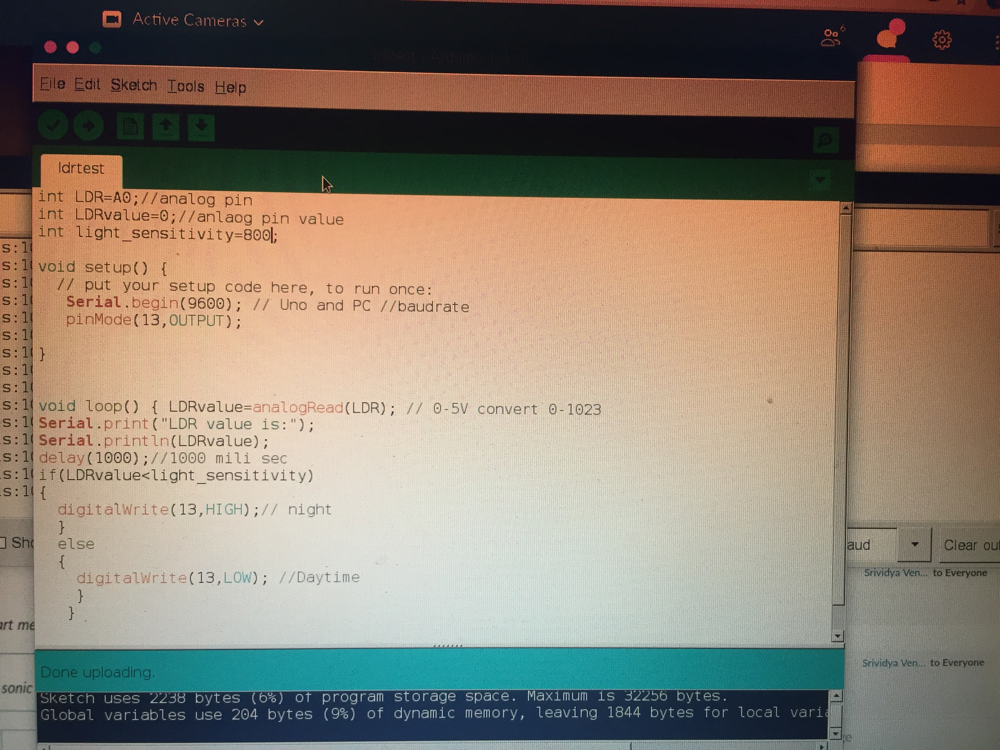
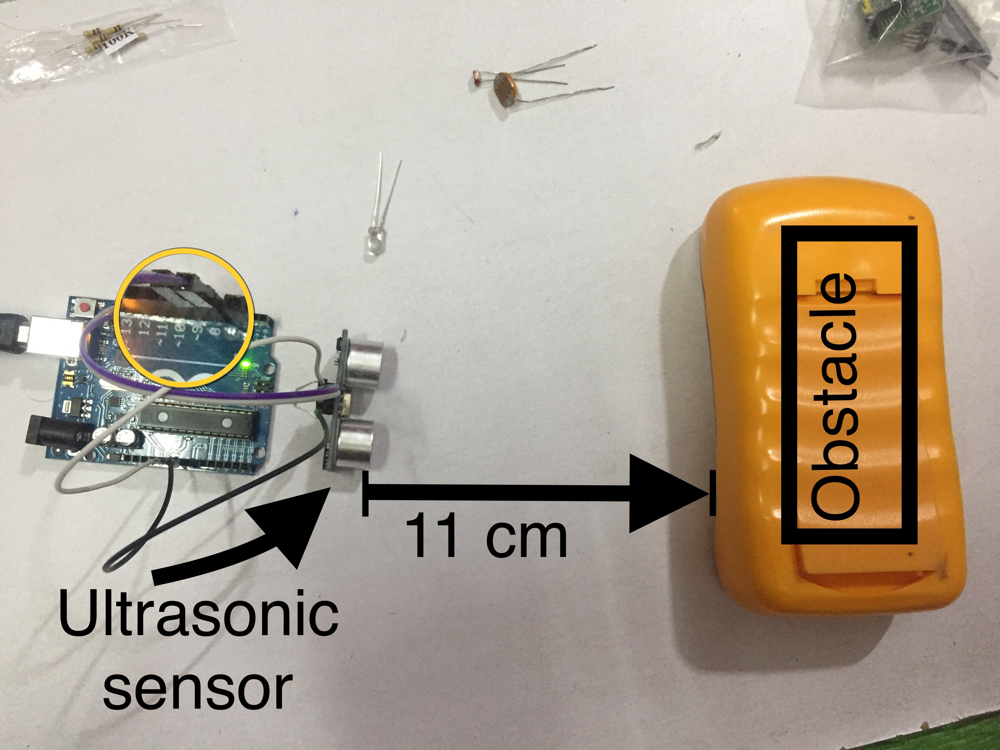
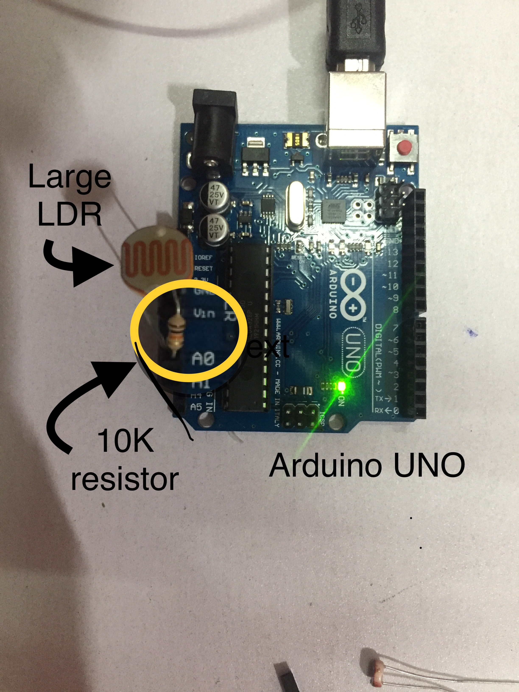
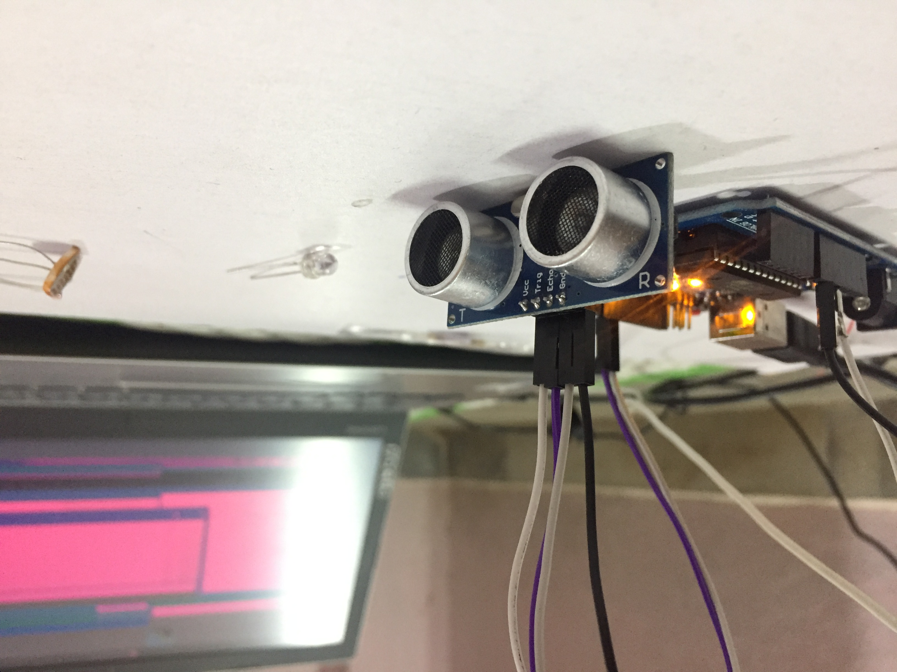

# Session - 2 Worked-out examples

## Basic Elements:
	• Battery voltage 
	• Measuring Battery voltage
	• Led circuit 
 

## Arduino

1 Blinking internal LED of an Arduino 

2 Start your first program Using LED

3 Auto on the street lights when its dark using LDR

4 Is there any obstacle? Using Ultrasonic sensor

